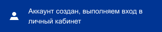
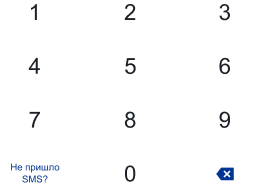

# Атомы
   1. Иконки, как ReactComponents
      ( _Иконки 8шт разместить в папку подправить какие-то свойства, проверить что все открываются, **примерно, 20-30мин**_ )
      
      >   
      

   2. Прямоугольная кнопка (GreyButton, BlueButton), например есть свойства (active, title)
      ( _Кнопки сверстать, для каждой написать свой ui, написать для них Story, потестировать **примерно, 60мин**_ )
      
      > 
      >
      > 
      

   3. Текст(например AppText), будет содержать свойство (text)
      ( _Попробовал бы реализовать компонент, как в react-native {Text}, затем каждый компонент, обернул в стили, + Story **навскидку, 60мин**_ )

        > 
        > 
        >  
        > 
        > 
        > 
        > 
        

   4. Загрузчики принимают, например, в качестве необязательного свойства текст состояния (text),
   ( _Стилизуем ellipse и в нее кладем иконку как компонент и текст? + Story, **примерно, 60мин**_ )

   4.1 Loading, LoadingWithText
   > 
   >
   > 

   4.2 LoaderSuccess, LoaderSuccessWithText
   > .png)
   >
   > 

   4.3 LoaderError, LoaderErrorWithText
   > .png)
   >
   > 

   
   5. Ссылка (Назад, Зарегистрируйтесь), принимает (path, children).
   ( _Стилизуем тег "a" внутрь кладем children + Story, **примерно, 60мин**_ )

   6. Checkbox
   ( _Стилизуем + Story **примерно, 60мин**_ )

   >   
      

   7. Кнопка клавиатуры (KeyboardButton), принимает свойство (title)
      ( _Стилизуем + Story **примерно, 60мин**_ )
      
   >  
   > 
   > 

   8. Кнопки подвала, (**_если это не меню телефона_**)
      ( _Стилизуем + Story **примерно, 60мин**_ )
      
   ### Итого: 
     Думаю с атомами управился бы за рабочий день
***    

# Молекулы

   ### 1. Из 2x атомов (ссылки и текста)
   ( _Стилизуем + Story **примерно, 30мин**_ )

   > 
      
      
   ### 2. Уведомления
   ( _Стилизуем + Story **примерно, 30-40мин**_ )

   Принимают в качестве свойства текст сообщения (text) 

   2.1 ErrorNotification
   > 

   2.2 SuccessNotification
   > 
 
   
   ### 3 Поле ввода
  ( _Стилизуем + Story **примерно, 60-120мин**_ )

   Например:
   >   

   > 

   > 
    
   > 
 
   > 

   ### 4 Соглашение
   ( _Стилизуем + Story **примерно, 30мин**_ )
   > 
 

   ### 5 Клавиатура
   ( _Стилизуем + Story **примерно, 60мин**_ )
   > 

   ### 6 Заголовок
   ( _Стилизуем + Story **примерно, 30мин**_ )
   Принимает свойства (children?, path)   

   >   

### Итого:
     Думаю с молекулами управился бы за рабочий день,
***

# Организмы
   
   ### Форма входа
   ( _Стилизуем + Story **примерно, 60мин**_ )
   > > 
   > >
   > > 
   > >
   > или
   > > 
   > >
   > > 
   
   
   ### Форма регистрации
   ( _Стилизуем + Story **примерно, 60мин**_ )
   > > 
   > > 
   > > 
   > >
   > > 
   > >
   > > 
   
   
   ### Форма подтверждения
   ( _Стилизуем + Story **примерно, 60мин**_ )
   > > 
   > >
   > > 
   
   
   ### Подвал
   ( _Стилизуем + Story **примерно, 60мин**_ )
   _Возможно это меню телефона_
   > 

### Итого:
     Думаю с организмами управился бы за 4 часа

***
# Шаблоны
   
   ### Header
   Например, на уровне шаблона регулируем текст заголовка
   * Ссылка назад
   * Текст заголовка

   ### Body
   * Форма ввода
   * Загрузчик

   ### Footer
   * Кнопки
      * Вперед
      * Назад
      * Увеличить
      * Переключение
      * Меню

   ### Page
   * Заголовок
   * Тело
   * Подвал

### Итого: 
     На шаблоны думаю затратить пару часов
***

# Страницы
   ### 1. Входа

   ### 2. Регистрации

   ### 3. Подтверждения входа

### Итого:
     На страницы думаю заратить пару часов

***
# Мысли в слух
     Оценить время выполнения мне довольно не просто. Бывает, что работа идет быстро, 
     а порой могу зависнуть на чем-нибудь казалось бы простом. 
     Итого за 3 дня, думвю, сверстал бы это приложение, без логики взаимодействия
        
      
    
    